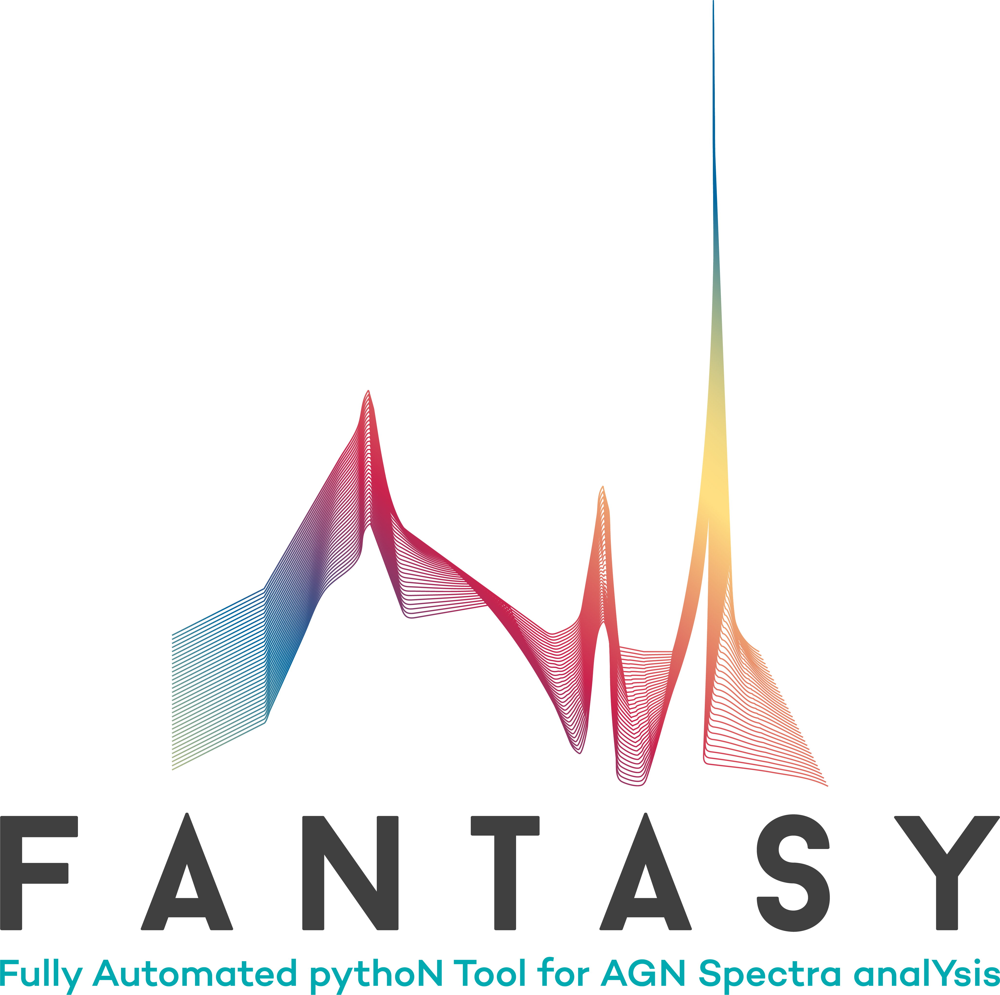

*Nemanja Rakić, Dragana Ilić and Luka Č. Popović*

With the growing number of spectral surveys and monitoring campaigns (e.g. reverberation mapping) of active galactic nuclei (AGN), there is an indispensable need for all the more innovative and independent tools for AGN spectra analysis and measurement of spectral parameter.  Especially in case of AGN, whose UV, optical and NIR spectra can be very complex with numerous blended and satellite emission lines (e.g., contamination of strong Fe II emission to the H\beta line), there is a strong desire for complex and flexible spectral fitting tools, which would enable the reliable extraction of spectral parameters, such as the flux of pure AGN continuum, or emission line fluxes and widths of heavily blended lines.
We present here the open source code FANTASY - Fully Automated pythoN tool for AGN Spectra analYsis, a python based code for simultaneous multi-component fitting of AGN spectra, optimized for the optical rest-frame band (3600-8000A), but also applicable to the UV range (2000-3600A) and NIR range (8000-11000A).
The code fits simultaneously the underlying broken power-law continuum and sets of defined emission line lists. There is an option to import and fit together the Fe II model, to fully account for the rich emission of complex Fe II ion which can produce thousands of line transitions, both in the range of Hg and Hb, but also Ha line (Ilic et al, 2022). The model is based on the atomic parameters of Fe II, and builds upon the models presented in Kovacevic et al. 2010, Shapovalova et al. 2012, and assumes that different Fe II lines are grouped according to the same lower energy level in the transition with line ratios connected through the line transition oscillatory strengths.
Before performing the fittings, the FANTASY code provide several preprocessing options to prepare the spectrum, namely:
Galactic extinction correction
redshift correction
host-galaxy fitting and subtraction


The code is flexible in the selection of different groups of lines, either already predefined lists (e.g., standard narrow lines, Hydrogen lines, Helium lines, other broad lines, forbidden Fe II lines, coronal lines, etc.), but gives full flexibility to the user to merge predefined line lists, create customized line list, etc. The code can be used either for fitting a single spectrum, as well as for the sample of spectra, which is illustrated in several given examples.
It is an open source, easy to use code, available for installation through pip install option. It is based on sherpa python package (Burke et al. 2019).


**If you are using this code in your research, please cite the following papers Ilic et al. 2020, Rakic et al. 2022, submitted, Ilic et al. 2022, in prep.**


For installation:
```console
foo@bar:~$ pip install fantasy_agn
```
For complete documentation with examples of usage please cosult [read the docs](www.fantasy-agn.readthedocs.io)
